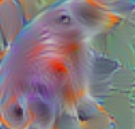
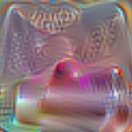

# For this Assignment, I have created an adversarial patch which was teh reuslt of merging patches for the goldfish class and the lipstick class. This patch when applied to an image will cause the image to be missclassified. 
The result largely depends on which of the tw patches, the goldfish or the lipstick have a greater influence on the patch during inference. 

## Here are the individual patches used for goldfish and Lipstick classes.

1. Goldfish - 

2. Lipstick - 

## Merged Patch 
